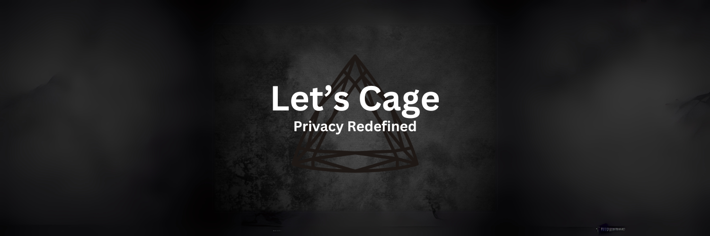

# 🕵️‍♂️ Letscage: Secure Messaging for a Private World 🕵️‍♀️

 <!-- Replace with your custom banner or logo -->

**Letscage** is a **peer-to-peer, end-to-end encrypted messaging app** designed to provide the highest level of privacy and security. Built for a world where privacy is a right, Letscage ensures your conversations remain completely confidential by operating over the **Tor network**.

---

## 🌟 Key Features

- **Peer-to-Peer Communication**: Direct, serverless communication for maximum privacy.
- **End-to-End Encryption**: Your messages are encrypted on your device and can only be decrypted by the intended recipient.
- **Tor Network Integration**: Secure, anonymous communication routed through Tor.
- **Multi-Platform Support**: Built with [Tauri](https://tauri.app), Letscage is available on:
  - **Windows**
  - **Linux**
  - **macOS**
  - **Android**
- **Mobile-First Design**: Optimized for seamless performance on mobile devices.

---

## 🎥 Demo

Watch Letscage in action:

Experience the sleek, intuitive interface of Letscage mobile. This demo showcases:
- Secure peer-to-peer messaging
- Real-time message delivery
- End-to-end encryption in action
- Tor network integration
- Mobile-optimized UI/UX

---

## 🛠 Built With

- **Programming Language**: [Rust](https://www.rust-lang.org/) for unparalleled performance and security.
- **Framework**: [Tauri](https://tauri.app) for lightweight, efficient cross-platform development.
- **Network**: [Tor](https://www.torproject.org/) for secure and anonymous communication.

---

## 🚀 Our Mission

Letscage is built with a singular purpose: to provide a secure and private messaging platform for individuals in an increasingly surveilled world. We believe in empowering people to take control of their digital privacy without compromise.

---

## 💡 How You Can Help

Privacy-focused development requires ongoing support. If you believe in the mission of Letscage, consider donating to help us sustain and grow the platform.

- **Monero (XMR):** `4286wRYWcg7hxjvWGpe8b1UeUeHRcEVqzhTmUg4595J4VXyVFGKQyPyAaumXkxprcBZ6M1n1qHL425aKA3agM7cdDuWuFHj`
- **Bitcoin (BTC):** `bc1qhsc8h059lkdhlha8hylusq6rtnv057afe5dsst`
- **Ethereum (ETH):** `0x764B16d0F86183776FbBBdE82C789550912c39b9`

Your contributions ensure we continue to innovate and protect the digital privacy of individuals worldwide.

---

## 📥 Download Letscage

Visit [Letscage.com](https://letscage.com) to download the app for your platform.

---

## 🛠 Contribute

We welcome contributions from developers, designers, and enthusiasts who share our passion for privacy. To get started:

1. Fork the repository.
2. Check out our [Contribution Guidelines](https://github.com/YourOrgName/Letscage/blob/main/CONTRIBUTING.md).
3. Submit a pull request with your enhancements.

---

## 📞 Contact Us

Have questions, feedback, or just want to connect? Reach out to us:

- Email: [sayhi@letscage.com](mailto:sayhi@letscage.com)
- Twitter: [@Letscage](https://twitter.com/letscage)

---

**✨ Together, we can create a safer, more private digital world. Join us! ✨**
